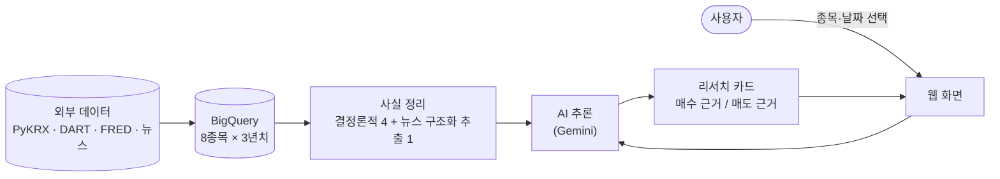

# AI 투자 리서치 에이전트

- 국내 상장기업 8곳을 골라 가격/공시/재무/거시지표/뉴스를 일배치로 수집하고, 해당 종목에 대한 분석 결과를 제공하는 서비스입니다.
- 모든 인프라는 GCP 무료~소액 크레딧 안에서 동작할 수 있도록 만들었습니다. 
- 공개 url은 추후 공개 예정입니다.

## Data

- 본 프로젝트에서는 샘플 8개 기업의 약 3년치 공시/시세/뉴스만 BigQuery에 저장합니다.

샘플 8종목:

| 종목코드 | 이름           |
| -------- | -------------- |
| 005930   | 삼성전자       |
| 000660   | SK하이닉스     |
| 005380   | 현대차         |
| 035420   | 네이버         |
| 035720   | 카카오         |
| 068270   | 셀트리온       |
| 105560   | KB금융         |
| 012450   | 한화에어로스페이스 |

데이터 출처:

| 출처 | 데이터 | 갱신/지연 | 신호 노드 윈도우 |
| --- | --- | --- | --- |
| PyKRX | 일별 시세 (OHLCV) | T-1 (장 마감 후 확정) | 직전 ~60–90영업일 (MA60·거래량 z-score) |
| PyKRX | 외국인/기관/개인 순매수 | T-1 (장 마감 후 집계) | 직전 5거래일 + 연속매수 streak |
| PyKRX | 공매도 잔고 | T-2 (공식 2영업일 지연) | 직전 5거래일 변동률 |
| DART OpenAPI | 공시 이벤트 | 실시간 | 직전 90일 카테고리별 건수 |
| DART OpenAPI | 분기 재무제표 (XBRL) | 분기 발표 시점 | as_of 직전 최신 분기 단건 |
| FRED | 한·미 기준금리, 원/달러, VIX | 일간/월간 (시리즈별 상이) | 최신값 + 1M·3M 변화 |
| 네이버 금융 RSS | 종목 뉴스 | 30분 폴링 | 직전 7일 |

각 신호 문장에는 `as_of` 메타가 강제로 붙어, 카드 상에서 "외국인은 T-1 기준 직전 7거래일 연속 순매수가 체결됨 (2026-05-14)" 형태로 시점을 명시합니다.

## Structure



- **시세 / 수급 / 공시 및 재무 / 거시** 4개 신호는 규칙 기반(pandas·SQL)으로만 사실 근거를 작성합니다(LLM 개입 X).
- **뉴스**는 7일치 기사를 임베딩 후 DBSCAN으로 중복을 묶고, 대표 기사 1건을 고정 스키마로 추출합니다. 
- 매수와 매도에 대한 평가를 따로 작성해 한쪽으로 치우치지 않도록 합니다.
- 평가 결과가 생성된 후, 각 인용이 진짜 근거에 부합하는지, '예상된다' 등의 미래 예측 표현이 섞였는지 한 번 더 검증합니다.

## How to Use (Private)

Prerequisite:

- Python 3.11+, uv
- GCP 프로젝트 생성 (gcloud auth login 인증 필요)
- Secret Manager에 4개 키 등록: `gemini-api-key`, `dart-api-key`, `fred-api-key`,
  `krx-credentials`

```bash
# 의존성 설치
uv sync

# (최초 1회) BigQuery 7개 테이블 생성
uv run python -m src.research.ingest.bq

# (최초 1회) 8개 종목 × 약 3년치 데이터 적재
uv run python -m src.research.ingest.data_loader

# 로컬 서버 띄우기
uv run uvicorn src.serve.app:app --reload --port 8080
```

브라우저에서 `http://localhost:8080/` 접속 후, 종목과 기준일을 고르고 '카드 생성' 클릭. 첫 생성은 약 90초, 두 번째부터는 캐시된 결과를 통해 더 빠른 시간 내 결과가 생성됩니다.

## API

| Method | URL                              | Description                                                       |
| ------ | --------------------------------- | ---------------------------------------------------------- |
| GET    | `/`                               | 웹 화면 (HTML)                                             |
| GET    | `/health`                         | 헬스체크                                                   |
| GET    | `/stocks`                         | 다루는 8종목 목록                                          |
| POST   | `/research/{stock_code}`          | 리서치 카드 생성 (`?force_refresh=true` 로 캐시 무시 재생성) |
| GET    | `/research/{stock_code}/history`  | 과거에 생성된 카드 목록                                    |